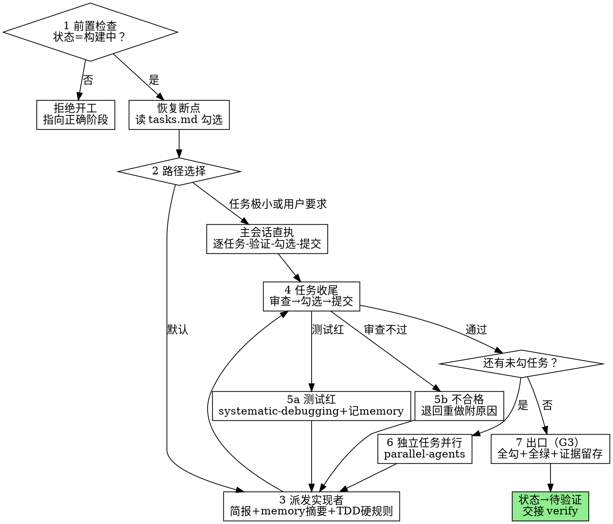

# Build——构建阶段

把确认过的计划书变成全绿的任务清单：逐任务实现→审查→勾选→提交，直到 tasks 全勾、测试全绿、命令输出证据在手，才交棒 verify。

**硬门禁（G3）：** tasks 未全勾、测试未全绿、没有命令输出证据，不得声称构建完成。前置是 G2 已过——`状态:` 不是`构建中`就拒绝开工。

**开场声明：**"我正在使用 build 技能执行实现计划。"

## 流程总览



## 七步流程

### 第 1 步：前置检查与断点恢复

- 读 `openspec/changes/<变更名>/proposal.md` 头部 `状态:` 字段：
  - `构建中` → 通过
  - `草稿`/`待确认规范` → 回 open 技能；`设计中`/`待确认计划` → 回 design 技能；`待验证`及之后 → verify / archive 从断点继续
- 恢复断点：读 `openspec/changes/<变更名>/tasks.md`——已勾任务视为已 DONE，不重做；从第一个未勾任务继续。勾选与 `git log` 对不上时，先核实 git 历史再修正勾选——git 是记录，你的记忆不是
- 确认在 `feature/<变更名>` 分支上（design 技能已创建）；需要与当前工作区隔离时用 git-worktrees 技能。未经用户明确同意，绝不在 main 上直接实现
- 通读 `openspec/plan/<变更名>.md` 一遍：记下全局约束，为每个任务建待办；发现任务彼此矛盾或计划有关键缺口，开工前一次性问清用户，不要执行到一半才停

### 第 2 步：选择执行路径

- **默认路径——逐任务派发子代理。** 按 subagent-driven 技能的完整任务循环执行：每任务一个全新子代理（不继承会话历史）、任务后审查（规格符合性＋代码质量）、修复循环上限五轮。简报/报告文件、审查包、模型选择、修复循环与断路器细则以该技能为准；本技能补充阶段特有的三要素（第 3 步）与出口（第 7 步）
- **直执降级路径。** 仅当任务极小（单文件微改）或用户明确要求主会话直执时启用：逐任务 → 按计划步骤原样执行 → 运行计划指定的验证 → 勾选 → 提交 → 下一任务。（直执纪律源自源插件技能，该技能未随本仓库迁移，其纪律已内联于本步。）
- 直执不豁免任何纪律：TDD、验证证据、逐任务提交照样适用，省去的只是派发
- **卡住即停，不硬闯：** 撞上阻碍（缺依赖、指令不明、验证反复失败、计划有关键缺口）→ 停下问用户，宁可问，不要猜

### 第 3 步：派发实现者（三要素）

默认路径下，每个任务的派发提示必须写明三要素，缺一不可：

1. **单任务计划全文**：把该任务的完整文本提取到独立简报文件（工作区 `.superpowers/sdd/<变更名>/task-N-brief.md`，工作区约定见 subagent-driven 技能），派发提示指向它——任务文本是需求的唯一来源，精确取值逐字使用；绝不让子代理通读整个计划书
2. **受影响模块 memory 摘要**：读 `.claude/ai-kb/memory/<模块>.md`，把与该任务相关的坑逐条摘进派发提示——前人踩过的坑不重踩
3. **TDD 硬规则**：引用 tdd 技能——子代理的首个产出必须是失败测试与失败运行证据；没有先失败的测试就没有生产代码

派发提示模板：

```text
先读 <简报路径>——它是你的完整需求，其中的精确取值逐字使用。
任务定位：<一行：本任务在项目中的位置>
前序接口：<前序任务做出的、简报无法知道的接口与决定>
memory 摘要：<受影响模块的坑，逐条；无则写"无">
TDD 硬规则：先写失败测试并运行确认失败，再写最小实现（tdd 技能·红-绿-重构）
报告写入 <报告路径>；只回传：状态、提交哈希、一行测试摘要、疑虑
```

其余派发纪律按 subagent-driven 技能执行：派发前记录 BASE（`git rev-parse HEAD`）；不粘会话历史；显式指定模型；实现任务默认串行派发。

### 第 4 步：每任务收尾

任务报告完成后，收尾三连，顺序固定：

1. **审查**：默认路径审查子代理的 diff 与测试证据——对照任务简报逐条查规格符合性，对照仓库惯例查代码质量（细则见 subagent-driven 技能）；直执路径自查对照任务的验收标准与测试输出。证据要亲眼看命令输出——"应该过了"不是证据（verification 技能）
2. **勾选**：审查通过才勾选 `tasks.md` 对应条目——勾选是断点真源，勾了就是宣称完成
3. **提交**：`git commit`（每任务至少一次）；提交后任务才算闭环

审查不通过 → 退回重做（第 5 步），不是你在主会话亲手修——控制者修复跳过审查。

### 第 5 步：故障路径

**测试红 / 意外行为：**
- 用 systematic-debugging 技能先定位根因，再动手修——未完成根因调查前禁止任何修复
- 坑定位并解决后，立即按 `.claude/ai-kb/README.md` 格式追加 `.claude/ai-kb/memory/<模块>.md`，标注来源变更——即时记，不攒到归档

**子代理不合格（BLOCKED / 反复不过审）：**
- 退回重做，并附原因与变化，四条分流：缺上下文 → 补充后同模型重派；需要更强推理 → 换更强模型重派；任务太大 → 拆小再派；计划本身有错 → 上报用户
- 绝不忽视升级请求，绝不毫无变化地强令同一模型重试——实现者说卡住了，就一定有什么需要变

### 第 6 步：独立任务并行

- 默认串行：实现任务并行极易冲突
- 仅当多个待办任务互相独立——无共享状态、无顺序依赖、各自动不同文件——时，按 parallel-agents 技能并行派发：一条消息里发出全部派发
- 汇合后照常：逐任务审查、核对各任务修复互不冲突、跑完整测试套件再勾选

### 第 7 步：出口（G3）

三件齐备才叫构建完成，缺一不可：

1. `tasks.md` 全部勾选
2. 测试全绿（完整套件，不是单个文件的子集）
3. 命令输出证据留存——测试输出与退出码，可复查

- 铁律（verification 技能）：没有新近的验证证据，禁止声称完成；"应该能过"不算证据
- 三者齐备 → `状态:` 置为 `待验证`，提交状态变更
- 交接：向用户呈报构建结果与证据摘要，审查由 verify 技能承接——subagent-driven 的全分支终审是收尾质量关，与 verify 两阶段审查（G4 门禁）定位不同，前者通过后仍须走后者

## 常见自我合理化

| 借口 | 现实 |
|---|---|
| "任务太小，跳过测试/审查" | G3 不管大小。四件套可以短，红-绿循环与证据不能省。 |
| "测试刚才还绿着" | 每次声称前现跑。上一次的绿只证明上一次的树。 |
| "我自己修更快，派发太费事" | 控制者修复跳过审查、污染协调上下文。退回实现者。 |
| "先勾上，证据回头补" | 勾选就是宣称完成。无证据的勾选是 G3 违规。 |
| "进度我记得住" | tasks.md 是断点真源。上下文压缩之后你什么都不记得。 |
| "这几个任务看着独立，一起派了" | 动同一批文件就不是独立。并行冲突的返工贵过串行等待。 |
