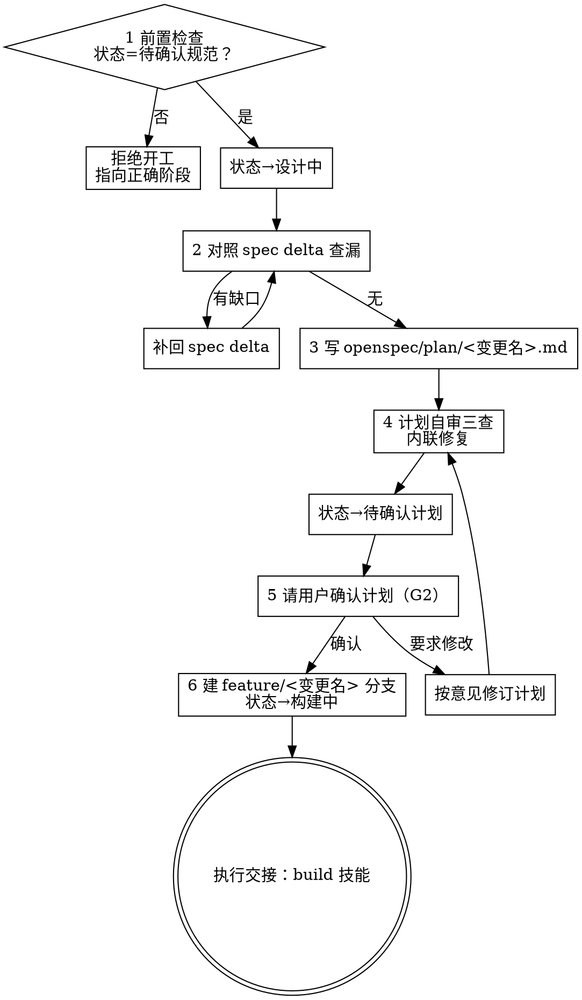

# Design——计划书阶段

把已确认的规格变成执行者零上下文也能照做的实现计划书：查漏、写计划、自审、请用户确认、建分支交接构建。

**硬门禁：** 前置是四件套已获用户确认（G1）——proposal 状态不是`待确认规范`就拒绝开工。出口是 G2——计划书未经用户明确确认，不得写任何实现代码。

**开场声明：**"我正在使用 design 技能编写实现计划。"

## 流程总览



## 六步流程

### 第 1 步：前置检查

- 读 `openspec/changes/<变更名>/proposal.md` 头部 `状态:` 字段
- 状态 = `待确认规范` → 通过，把状态置为`设计中`，继续
- 其他状态 → 拒绝开工，指向正确阶段：
  - `草稿`或四件套不全：先走 open 技能完成并确认
  - `待确认计划`：计划已写好，去请用户确认，不要重写
  - `构建中`及之后：去 build / verify / archive 技能，从断点继续
- 范围复检：规格若覆盖多个独立子系统，本应在 open 阶段分解；没有分解就建议拆成多份计划——一个子系统一份，每份计划独立产出可工作、可测试的软件

### 第 2 步：对照 spec delta 查漏

拿 `specs/<能力>/spec.md` 的 delta 逐条对读，找三类缺口：

- **边界场景**：每条 Requirement 的 Scenario 只写了主路径？边界条件（空输入、并发、超限、失败重试）有没有落点？
- **错误处理**：失败路径写了吗——报什么错、谁接住、怎么退？
- **被漏需求**：回读澄清问答与 proposal，用户提过、delta 里没有的要求

有缺口 → **先补回 spec delta**（保持 Requirement 的 ADDED/MODIFIED/REMOVED 标注与每条至少一个 Scenario 的格式），再继续。补回改变了需求范围时，先向用户说明——已确认的规格不能悄悄变形。

### 第 3 步：写计划书

保存到 `openspec/plan/<变更名>.md`。

**受众假设：** 执行者对代码库零上下文、品味存疑。写下他们需要的一切：每个任务动哪些文件、代码、测试、可能要查的文档、怎么测。假设他们是熟练开发者，但对本仓库的工具链与问题域几乎一无所知，也不太懂好的测试设计。DRY、YAGNI、TDD、频繁提交。

**先画文件结构：** 定义任务之前，先列出要创建/修改的文件及各自职责——分解决策在此锁定。一个文件一个清晰职责；一起变的文件放在一起，按职责切分而非按技术分层；存量代码遵循既有模式，不单方面重构（要改的文件已经臃肿时，把拆分纳入计划是合理的）。文件结构决定任务分解——每个任务产出独立成立、可独立测试的变更。

**任务切分：** 任务是自带测试周期、值得一次独立审查的最小单元。把 setup、配置、脚手架、文档步骤折叠进需要它们交付的任务；只在"审查者可能否决一个任务而通过相邻任务"处切分。每个任务以可独立测试的交付物收尾。

**步骤粒度（bite-size）：** 每步一个动作（2-5 分钟）——写失败测试、运行确认失败、写最小实现、运行确认通过、提交，各算一步。

**计划书头部模板：**

```markdown
# <变更名> 实现计划

> **执行者须知：** 必须使用 subagent-driven（推荐）或逐任务直执方式实现本计划，一次一个任务。步骤用 `- [ ]` 复选框追踪。

**目标：** <一句话：构建什么>

**架构：** <2-3 句：方法与思路>

**技术栈：** <关键技术/库>

## 全局约束

<规格的项目级要求——版本下限、依赖限制、命名与文案规则、平台要求——
每条一行，精确取值逐字复制自规格。每个任务的要求都隐含包含本节。>

---
```

**任务节模板：**

````markdown
### Task N: <组件名>

**Files:**
- Create: `精确/路径/新文件.py`
- Modify: `精确/路径/既有文件.py:123-145`
- Test: `tests/精确/路径/test_x.py`

**Interfaces:**
- Consumes: <使用前序任务的什么——精确签名>
- Produces: <后续任务依赖什么——精确函数名、参数与返回类型>

- [ ] **Step 1: 写失败测试**

<实际测试代码，不是对测试的描述>

- [ ] **Step 2: 运行测试确认失败**

Run: `pytest tests/path/test_x.py::test_name -v`
Expected: FAIL "function not defined"

- [ ] **Step 3: 写最小实现**

<实际实现代码>

- [ ] **Step 4: 运行测试确认通过**

Run: `pytest tests/path/test_x.py::test_name -v`
Expected: PASS

- [ ] **Step 5: 提交**

git add <本任务文件清单> && git commit -m "feat: <一句话>"
````

任务的执行者只看得到自己的任务——**Interfaces 块是他们得知相邻任务所用名称与类型的唯一途径**，精确签名不可省。

**无占位符（出现即计划失败）：**

- "TBD"、"TODO"、"稍后实现"、"细节后补"
- "加上适当的错误处理"、"加校验"、"处理边界情况"
- "为上述内容写测试"（不带实际测试代码）
- "与 Task N 类似"（把代码重写一遍——执行者可能乱序读任务）
- 只说要做什么、不展示怎么做的步骤（代码步骤必须带代码块）
- 引用任何未在任务中定义过的类型、函数或方法

### 第 4 步：计划自审

写完整个计划，带着新鲜的眼光对照规格自查——这是你自己跑的清单，不派子代理：

1. **spec 覆盖**：扫规格每节、每条 Requirement——能指出实现它的任务吗？列出全部缺口
2. **占位符扫描**：在计划里搜"无占位符"清单的每一种模式，发现即修
3. **接口一致性**：后续任务用的类型、方法签名、属性名与前序任务定义的一致吗？Task 3 叫 `clearLayers()`、Task 7 叫 `clearFullLayers()` 就是 bug

发现问题内联修复——修完即走，不必重审。规格里有任务没覆盖的要求，把任务补上。

### 第 5 步：请用户确认计划（G2）

自审通过后，`状态:` 置为 `待确认计划`，向用户呈报：

> 计划书已就绪：`openspec/plan/<变更名>.md`（N 个任务）。
> 确认后我将创建 `feature/<变更名>` 分支并转入 build 技能开工；要修改请直接说。

- 等待用户答复。用户要求修改：修订计划，重跑第 4 步自审，再次呈报
- **用户确认之前，一行实现代码都不写**（G2）

### 第 6 步：确认后收尾

1. 创建分支 `git checkout -b feature/<变更名>`；需要与当前工作区隔离时，用 git-worktrees 技能
2. `状态:` → `构建中`
3. 提交计划与状态：`git add openspec/plan/<变更名>.md openspec/changes/<变更名>/proposal.md && git commit -m "docs(plan): <变更名> 实现计划"`

**执行交接：** 告知用户计划就绪，执行由 build 技能承接——默认逐任务派发子代理（subagent-driven 技能），任务极小或用户要求时主会话直执。用户当场说"开工"，直接转入 build 技能。

## 常见自我合理化

| 借口 | 现实 |
|---|---|
| "规格很清楚，不用逐条对照" | 漏一条 Requirement，构建就缺一块。逐条对读是本阶段的存在理由。 |
| "占位符执行者自己会填" | 计划里的 TBD 会原样变成代码里的 TBD。写不出实际内容＝你还没想清楚，回第 2 步查漏。 |
| "接口名执行者能对上" | 执行者只看得到自己的任务。clearLayers 与 clearFullLayers 的不一致只能在计划里堵住。 |
| "顺手把环境搭了吧" | G2：计划未确认不写实现代码。脚手架也是实现。 |
