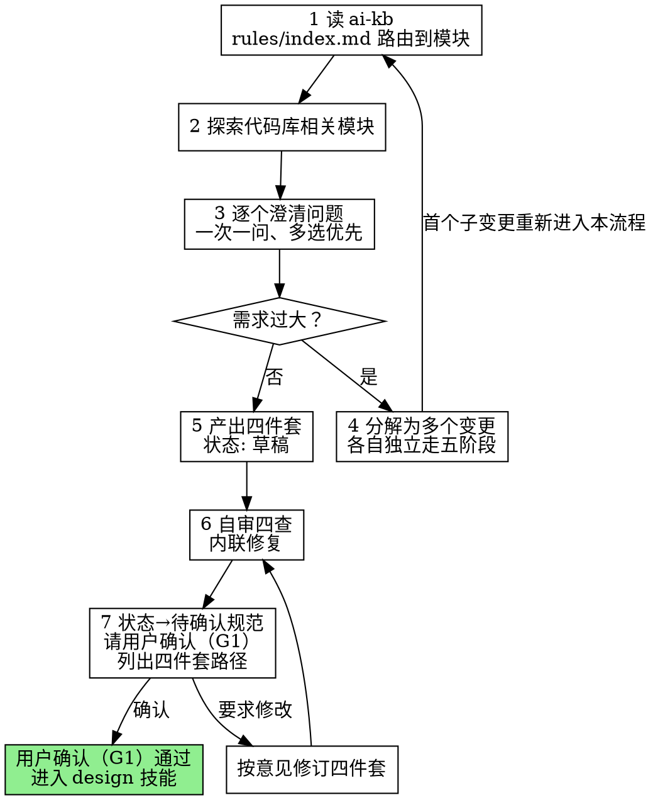

# Open——需求开启阶段

把一个想法变成经得起构建的变更四件套：先读知识库，再探索代码，逐个澄清问题，落成规格，请用户确认。

**硬门禁（G1）：** 四件套未经用户明确确认，不得编写计划，不得写任何实现代码、搭任何脚手架。没有例外——"这个需求太简单"恰恰是未经检验的假设最藏身的地方。四件套可以很短，确认一步不能省。

**开场声明：**"我正在使用 open 技能开启需求并产出四件套。"

## 流程总览

## 七步流程

### 第 1 步：读 ai-kb

- 先读 `.claude/ai-kb/rules/index.md`，按模块名、别称、关键词路由到本次需求涉及的模块
- 再读路由命中的 `.claude/ai-kb/kb/<模块>.md` 与 `.claude/ai-kb/memory/<模块>.md`
- memory 记录的是前人踩过的坑——重蹈覆辙是最贵的浪费
- 读 kb 时发现内容与代码现状不符：向用户提示过时，留待归档阶段同步，本阶段不重写

### 第 2 步：探索代码库相关模块

- 先看当前项目状态：文件、文档、近期提交
- 再看路由到的模块代码，摸清现状结构，之后的提议遵循既有模式

### 第 3 步：逐个澄清问题

**硬规则（违反即返工）：**

- **一次一问。** 每条消息只包含一个问题；一个话题需要更多探索，就拆成多个问题依次问
- **多选优先。** 尽量出选择题（选项附推荐与理由），开放式问题也可以，但排在第二
- **聚焦三件事：目的、约束、成功标准**
- 任何不确定：停下问用户，不猜

**违禁示例：**"这个项目要支持哪些数据库？另外缓存用什么？超时设多少？"——三个问题一次抛出，用户只会挑着答，剩下两个变成你的假设。

### 第 4 步：需求过大则分解

- 判断时机在澄清早期：需求一旦描述出多个独立子系统（如"做个带聊天、文件存储、计费、分析的平台"），立即标记——别把提问浪费在需要先分解的需求细节上
- 与用户一起分解：独立的部分是什么？彼此什么关系？按什么顺序建？
- 每个变更独立走完整的五阶段（各自的四件套→计划→构建→审查→归档）；本次 open 只继续第一个变更

### 第 5 步：产出四件套

格式权威：`openspec/AGENTS.md`。目录：`openspec/changes/<kebab-case变更名>/`

| 文件 | 内容 |
|---|---|
| `proposal.md` | 为什么 / 做什么 / 影响；头部 `状态:` 字段（8 态取值） |
| `specs/<能力>/spec.md` | delta：每条 Requirement 标注 ADDED/MODIFIED/REMOVED，**每条至少一个 Scenario**（WHEN/THEN） |
| `design.md` | 关键决策与取舍（索引性质） |
| `tasks.md` | 任务清单，`- [ ] N.M` 编号勾选 |

- 动笔时 `状态: 草稿`
- Scenario 要覆盖每条 Requirement 的主路径；边界与错误路径的系统性查补由 design 技能第 2 步（对照 spec delta 查漏）承接
- 装有 openspec CLI 的机器上运行 `openspec validate <变更名> --strict --no-interactive`，按报错修正格式；未装 CLI 跳过，格式以 AGENTS.md 为准

### 第 6 步：自审四查

写完四件套，换一双眼睛重读一遍：

1. **占位符**：有没有 TBD、TODO、空节、含糊要求？修掉
2. **矛盾**：各文件之间有没有互相矛盾？spec 与 proposal 的描述一致吗？
3. **歧义**：有没有哪条要求能被读出两种意思？选定一种，写明确
4. **范围**：这份四件套聚焦到能用一份计划书实现吗？还是需要回到第 4 步再分解？

发现问题内联修复——修完即走，不必重审。修复触及需求本身时，回到第 3 步向用户补一次澄清。

### 第 7 步：请用户确认（G1）

自审通过后，把 `状态:` 改为 `待确认规范`，向用户呈报（明确列出四件套路径）：

> 四件套已就绪，请确认：
>
> - `openspec/changes/<变更名>/proposal.md`
> - `openspec/changes/<变更名>/specs/<能力>/spec.md`
> - `openspec/changes/<变更名>/design.md`
> - `openspec/changes/<变更名>/tasks.md`
>
> 确认后进入 design 技能编写实现计划；要修改请直接说。

- 等待用户答复。用户要求修改：修订四件套，重跑第 6 步自审，再次呈报
- **用户确认之前，任何计划、任何实现代码都不动**（G1）
- 用户确认后：转入 design 技能（或等用户说"确认规范，出计划"）

## 常见自我合理化

| 借口 | 现实 |
|---|---|
| "需求很清楚，不用问了" | 你猜的每个假设都会变成构建期的返工。一次一问，问清为止。 |
| "一次问完效率高" | 一次多问＝用户挑着答＝剩下全靠猜。硬规则，没有例外。 |
| "太小了不用走这套" | 简单需求正是未经检验假设藏身之处。四件套可以短，确认不能省。 |
| "先起草个计划没事吧" | G1：四件套未确认不得写计划。草案也是违规。 |
