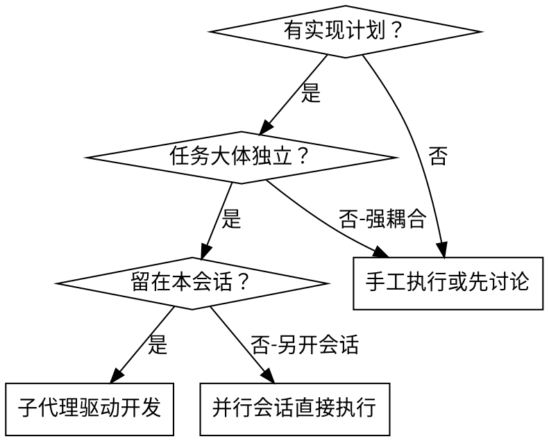
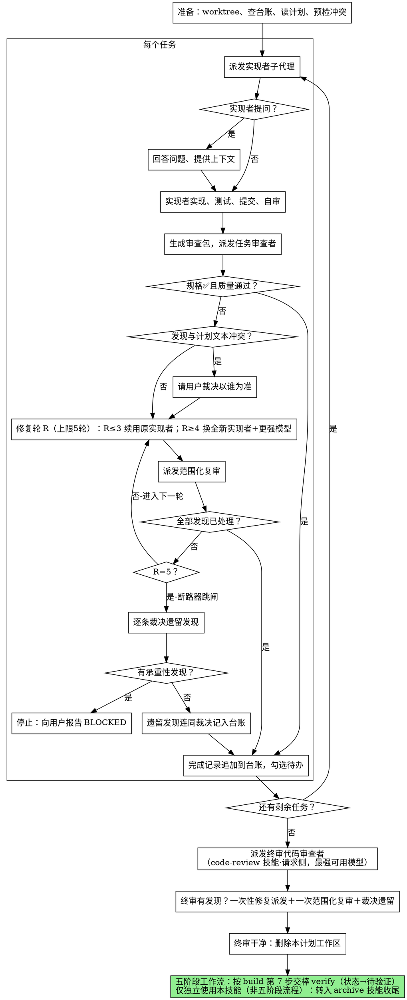

# 子代理驱动开发

逐任务派发一个全新的实现者子代理来执行计划，每个任务之后做一次任务审查（规格符合性＋代码质量），全部任务结束后做一次覆盖整个分支的终审。

**为什么用子代理：** 你把任务委派给拥有隔离上下文的专门代理。通过精确构造它们的指令与上下文，你确保它们保持专注并完成各自任务。它们绝不继承你会话的上下文或历史——你精确构造它们所需的一切。这同时把你自己的上下文留给协调工作。

**核心原则：** 每任务一个全新子代理 ＋ 任务审查（规格＋质量）＋ 收尾宽域终审 ＝ 高质量、快迭代。

**叙述纪律：** 工具调用之间，至多用一行短句叙述——台账与工具结果承担记录。

**连续执行：** 不要在任务之间停下来向用户请示。不间断地执行计划里的全部任务。仅三种情况可以停：你无法解决的 BLOCKED 状态、真正阻碍前进的歧义、全部任务完成。"要继续吗？"式的请示与进度汇报浪费用户时间——用户让你执行计划，那就执行。

## 何时使用



**对比"并行会话直接执行计划"：**
- 同一会话（无上下文切换）
- 每任务全新子代理（无上下文污染）
- 每任务后审查（规格符合性＋代码质量），收尾宽域终审
- 迭代更快（任务之间无人工介入）

## 流程



## 准备

确保工作发生在隔离的工作区：使用本仓库 git-worktrees 技能创建或确认它。未经用户明确同意，绝不在 main/master 分支上开始实现。

会话记忆撑不过上下文压缩。真实会话里，丢失进度的控制者曾把整段已完成的任务序列重新派发一遍——这是观察到的最昂贵失败。把进度记在台账文件里，不要只记在待办清单。

- 每份计划拥有一个工作区：技能启动时确定本计划的工作区目录（`<仓库根>/.superpowers/sdd/<计划文件名去扩展名>/`，git 忽略的草稿区）——它是本计划全部产物的家：台账、任务简报、报告、审查包。别的计划的目录绝不是你可以读写的。
- 到 `<工作区>/progress.md` 查本计划台账。若首行写明本计划文件，则带 `Task <N>: complete` 行的任务已 DONE——不要重新派发；从第一个没有该行的任务恢复。某任务最后一行是修复轮记录，说明它正处循环中：从下一轮恢复。首行写着别的计划文件——或旧扁平路径 `.superpowers/sdd/progress.md` 下有游离台账——那是别的计划的进度：留在原地，另起自己的新台账。
- 创建台账时把身份写进首行：`# SDD 台账 — 计划: <计划文件路径>`。
- 台账是你的恢复地图：它记载的提交在 git 里真实存在，即使你的上下文已不记得创建过它们。压缩之后，相信台账和 `git log`，胜过相信你自己的回忆。
- `git clean -fdx` 会摧毁工作区（它是 git 忽略的草稿区）；若发生，从 `git log` 恢复。

把计划通读一遍，记下其上下文与全局约束，并为每个任务建一条待办。

派发任务 1 之前，把计划整体扫一遍查冲突：

- 任务彼此矛盾、或与计划的全局约束矛盾
- 计划明确强制、但审查规则会视为缺陷的任何内容（断言空操作的测试、逻辑块的原样重复）

把找到的一切作为一批问题呈给用户——每条发现并列强制它的计划原文，问以谁为准——在开工前问完，而不是执行中途每发现一条就打断一次。扫描干净就默不作声继续。审查循环仍是兜底，接住那些只有实现过程中才暴露的冲突。

（源技能附有 scripts/sdd-workspace、scripts/task-brief、scripts/review-package 辅助脚本及 implementer-prompt.md、task-reviewer-prompt.md、re-review-prompt.md 三个派发模板，均未随本仓库迁移；其核心行为已按下文内联为仓库内手工步骤。）

## 模型选择

用能胜任各角色的最弱模型，省成本、提速度。

**机械性实现任务**（孤立的函数、明确的规格、1-2 个文件）：用快而便宜的模型。计划写得好时，大多数实现任务都是机械的。

**集成与判断任务**（多文件协调、模式匹配、调试）：用标准模型。

**架构与设计任务**：用最强可用模型。全分支终审属于此类——用最强可用模型派发，而非会话默认模型。

**审查任务**：以同等判断力选模型，规模随 diff 的大小、复杂度与风险伸缩。小的机械 diff 不需要最强模型；微妙的并发改动需要。小修复 diff 的范围化复审用中低档。

**修复循环升级（第 4-5 轮）**：用比卡住的实现者高一档的模型。

**派发子代理时永远显式指定模型。** 省略模型会继承你会话的模型——往往最强也最贵——悄悄架空本节。

**轮数胜过 token 单价。** 墙钟时间与上下文成本随子代理的轮数增长，而最便宜的模型在多步工作上经常要多花 2-3 倍轮数——总成本反而更高。审查者与按散文描述工作的实现者，下限用中档模型。当任务的计划文本已含要写的完整代码，实现就是誊写加测试：用最便宜档。单文件机械修复同样用最便宜档。

**任务复杂度信号（实现任务）：**
- 动 1-2 个文件且规格完整 → 便宜模型
- 动多个文件且有集成顾虑 → 标准模型
- 需要设计判断或广泛理解代码库 → 最强模型

## 任务循环

你粘进派发提示的一切——以及子代理回传的一切——都会驻留在你的上下文里直到会话结束，并在之后每一轮被重读。产物以文件形式交接。

### 1. 派发实现者

派发前记录 BASE（`git rev-parse HEAD`）——审查包与修复轮 diff 都需要它。

- **任务简报：** 派发实现者之前，把该任务的完整文本提取到一个唯一命名的文件（`<工作区>/task-N-brief.md`），让简报成为需求的唯一来源。你的派发提示应包含：(1) 一行话说明本任务在项目中的位置；(2) 简报路径，并介绍为"先读这个——它是你的完整需求，其中的精确取值须逐字使用"；(3) 前序任务做出的、简报无法知道的接口与决定；(4) 你在简报里注意到的任何歧义的裁决；(5) 报告文件路径与报告契约。精确取值（数字、魔法字符串、签名、测试用例）只出现在简报里。绝不让子代理通读整个计划文件。
- **报告文件：** 报告文件与简报同名配对（简报 `…/task-N-brief.md` → 报告 `…/task-N-report.md`），路径写进派发提示。实现者把完整报告写在那里，只回传四样：状态、提交哈希、一行测试摘要、疑虑。
- 派发提示描述一个任务，不是会话的历史。不要把累积的前序任务摘要（"任务 1-3 之后的状态"）粘进后续派发——真实会话曾有派发提示达 42k 字符、其中 99% 是粘贴历史的教训。全新子代理需要的是它的任务、它触碰的接口与全局约束，仅此而已。
- 若更早任务在本任务触碰的区域搁置过发现，在派发中携带指向该台账条目的指针。
- 从派发结果记录实现者的代理身份——修复循环第 1-3 轮要续用这个代理。
- 绝不并行派发多个实现子代理（会冲突）。

### 2. 处理报告

实现者子代理回报四种状态之一，分别处理：

**DONE：** 生成审查包（见下文"审查任务"），随后带着生成的文件路径派发任务审查者。

**DONE_WITH_CONCERNS：** 实现者完成了工作但标记了疑虑。先读疑虑再前进。若疑虑关乎正确性或范围，先处理再审查。若只是观察（如"这个文件越来越大了"），记下并进入审查。

**NEEDS_CONTEXT：** 实现者需要未被提供的信息。补上缺失的上下文，重新派发。

**BLOCKED：** 实现者无法完成任务。评估阻碍：
1. 上下文问题 → 补充上下文，同模型重新派发
2. 需要更强推理 → 换更强模型重新派发
3. 任务太大 → 拆成更小的块
4. 计划本身有错 → 上报用户

**绝不**忽视升级请求，或毫无变化地强令同一模型重试。实现者说卡住了，就一定有什么需要变。

实现者提问——开工前或任务中——清晰完整地回答，需要时补充上下文，不催促它赶进实现。

### 3. 审查任务

逐任务审查是任务范围的关卡。宽域审查只发生一次，在终审。绝不跳过任务审查，也绝不接受缺少任一裁决的报告——规格符合性与任务质量两者缺一不可。实现者自审永远不能替代任务审查；两者都要。

- 把 diff 以文件形式交给审查者：把 `git log --oneline <BASE>..<HEAD>`、`git diff --stat <BASE>..<HEAD>` 与 `git diff -U10 <BASE>..<HEAD>` 的输出重定向到一个唯一命名的文件（本仓库约定 `<工作区>/review-<base7>..<head7>.diff`），把文件路径交给审查者。输出绝不进入你自己的上下文，审查者一次 Read 就能看到提交列表、统计摘要与带上下文的完整 diff。BASE 用你派发实现者前记录的那个——绝不是 `HEAD~1`，那会悄悄截掉多提交任务中除最后一次提交外的全部。绝不派发没有 diff 文件的任务审查者。
- **审查者输入：** 任务审查者拿到三个路径——同一个简报文件、报告文件、审查包——外加约束本任务的全局约束。
- 你交给审查者的全局约束块是它的注意力透镜。从计划的全局约束节或规格逐字复制有约束力的要求：精确取值、精确格式、组件之间被陈述的关系（"与 X 同布局"、"匹配 Y"）。审查者模板已带流程规则（YAGNI、测试卫生、审查方法）——约束块装的是本项目规格的要求。
- 不要添加"检查所有用法"或"有用就跑竞态测试"这类开放式指令，除非有具体的、本任务专属的理由
- 不要要求审查者重跑实现者已在同一代码上跑过的测试——实现者的报告带着测试证据
- 不要替审查者预判发现——绝不指示审查者忽略或不标记某个具体问题。如果你认为某条发现会是误报，让审查者把它提出来，在审查循环里裁决。你正在写的提示里若出现"不要标记"、"别把 X 当缺陷"、"至多 Minor"、"计划选择了"——停下：你在预判，通常是为了省自己一轮审查循环。
- 任务审查者可能报告"⚠️ 无法从 diff 验证"项——存在于未改动代码中或跨越任务的需求。这些不阻塞其余审查，但你必须在标记任务完成前亲自解决每一条：你握有审查者缺少的计划与跨任务上下文。若确认某项是真实缺口，按规格审查失败处理——与其他发现一起进入修复循环。

（本节与修复循环对应源技能的 task-reviewer-prompt.md 与 re-review-prompt.md 派发模板，未随本仓库迁移；审查者输入、双裁决与复审规则已内联如上。）

### 4. 修复循环

审查报告规格 ❌、任何 Critical 或 Important 发现、或你确认为真实缺口的 ⚠️ 项时，循环触发。

循环开始之前，两条路径立即离开它：

- 随手把 Minor 发现记入进度台账（`Task <N>: minor（缓办）: <一行摘要>`），并让终审对准这张清单，由它分诊哪些必须合并前修掉。没人读的汇总等于静默丢弃。Minor 发现绝不进循环。
- 标记为"计划强制"的发现——或任何与计划文本要求相冲突的发现——是用户的决定，如同任何计划矛盾：呈上发现与计划原文，问以谁为准。不要因为计划强制就驳回发现，也不要不经询问就派发与计划相矛盾的修复。

其余全部进入循环。一轮修复＝一次修复派发＋一次范围化复审。每任务最多五轮：

**第 1-3 轮——续用原实现者。** 把未决发现逐字发给它。它的上下文完好：它知道任务、代码和自己的选择。若你的运行环境无法向存活中的子代理再发消息，就派发一个全新实现者，携带简报路径、报告文件路径与发现清单——无论哪条路，报告文件都是持久记忆。

**第 4-5 轮——换更强模型派发全新实现者**（见"模型选择"），携带简报路径、报告文件路径、未决发现，以及这句框架："先前的实现者已尝试此任务 [N] 次未成；现在由你接手。读报告文件了解已试过什么。"撑过三次续用的循环通常意味着实现者看不见自己的问题——一次动作同时换新眼睛和升能力。

**每一轮，无论哪种方式：** 实现者修复、重跑覆盖被改代码的测试、把修复报告追加到同一报告文件、回传短契约。重新派发审查者之前，确认修复报告包含覆盖测试、运行的命令与输出三样；三者齐了才派发复审。修复消息里点名覆盖测试的文件——一行修复不需要整个套件。

**复审是范围化的。** 生成仅覆盖修复范围的审查包（FIX_BASE 取上一轮审查所见的 head，把 `git log --oneline`、`git diff --stat`、`git diff -U10`（覆盖 FIX_BASE..HEAD）重定向到一个新的唯一命名文件），派发复审，附发现清单、简报、报告文件与 diff 路径。复审者对每条发现裁决 ADDRESSED 或 NOT ADDRESSED，且只在修复 diff 里标记新破坏。修复 diff 里新的 Critical/Important 破坏并入未决清单。范围外的观察作为缓办 minor 记入台账——它们绝不延长循环。

**每轮之后**，向台账追加：
`Task <N>: fix round <R>/5 (<X> 已处理, <Y> 未决 — <发现一行摘要>; commits <a7>..<b7>)`

绝不在控制者会话里亲自修发现——你的上下文要保持干净用于协调，且控制者修复会跳过审查。

**断路器。** 第 5 轮复审仍有发现未决时，停止派发。由你逐条裁决未决发现——你握有审查者缺少的计划与跨任务上下文：

- **审查者错了，或论点有争议：** 搁置——`Task <N>: parked — <发现> — 裁决: <代码为何成立>`。终审将看到双方。
- **真实，但下游无物构建于其上：** 同样搁置，裁决写明真实且缓办。
- **真实且承重**——后续任务构建于其上，或暴露计划缺陷：停。追加 `Task <N>: BLOCKED — <原因>` 并向用户报告发现、与之相撞的计划原文与修复历史。搁置一个结构性失败会让每个依赖任务都建在它上面，并把终审无法修复的问题塞给终审。

只在封顶时裁决。为终结循环而提前裁决是预判换了名字。每次裁决都是一条台账记录——静默丢弃被禁止。

### 5. 完成任务

审查干净返回时——或断路器跳闸后每条未决发现都带裁决搁置时——与其他簿记同一条消息里向台账追加完成行：

- `Task <N>: complete (commits <base7>..<head7>, review clean)`
- 断路器跳闸后：`Task <N>: complete (commits <base7>..<head7>, <K> parked)`

然后勾选待办，继续。审查还有未修复、也未在封顶时带裁决搁置的 Critical/Important 问题时，绝不进入下一任务。

## 终审

全分支终审也要一份审查包：MERGE_BASE 取分支起点提交（如 `git merge-base main HEAD`），把 `git log --oneline`、`git diff --stat` 与 `git diff -U10`（覆盖 MERGE_BASE..HEAD）重定向到一个唯一命名文件，把该路径写进终审派发提示，让终审者读一个文件，而不是用 git 命令重新推导分支 diff。用最强可用模型派发（见"模型选择"），按本仓库 code-review 技能·请求侧的审查者要求执行（源技能此处引用其 code-reviewer.md 模板，该模板未随本仓库迁移，核心规则已内联于 code-review 技能）。让它对准台账的缓办 minor 与搁置行，分诊哪些必须合并前修掉。

若全分支终审返回发现，派发恰好一个修复子代理，携带完整的发现清单——不是每条发现一个修复者。逐条发现各派一个修复者会各自重建上下文、各自重跑套件；真实会话的终审修复波花费超过其全部任务之和。然后对修复波做恰好一次范围化复审（覆盖修复范围的审查包，复审规则同任务循环）。遗留发现按任务循环的断路器同样裁决：带裁决搁置，或对承重项停下。没有第二波修复——遗留的承重发现留给用户，在 archive 技能呈报选项时浮出。

## 收尾

全分支终审干净且其修复已合并后，删除本计划工作区（`rm -rf <工作区>`）——git 历史从此就是记录。兄弟目录属于其他计划；别碰。

五阶段工作流中，终审通过后不直接收尾分支——按 build 技能第 7 步交棒 verify（状态→待验证），两阶段审查通过后再由 archive 技能归档；仅独立使用本技能（非五阶段流程）时，分支的合并与收尾才直接转入本仓库 archive 技能（源技能此处引用其分支收尾技能，该技能未随本仓库迁移，其职责由归档流程覆盖）。

## 常见自我合理化

| 借口 | 现实 |
|--------|---------|
| "规格符合性差不多就行" | 审查者发现了规格缺口＝没完成。修掉，或到封顶后裁决——只有这两条出口。 |
| "我自己修更快，派发太费事" | 控制者修复污染你的上下文且跳过审查。续用实现者。 |
| "再来一轮就会收敛" | 过了封顶，轮次不会收敛——失败是结构性的。裁决并分流。 |
| "审查者反正总会找出新东西" | 范围化复审只验证修复；它不能游荡。未触碰代码上的新发现进台账，不进循环。 |
| "这条发现明显是错的，扔掉" | 你只在封顶时裁决，且每次裁决都是台账记录。静默丢弃被禁止。 |
| "修复很小，跳过复审" | 未复审的修复正是回归落地的方式。每轮都以一次范围化复审收尾。 |
| "审查拖慢循环" | 没有审查的循环只是未经验证的空转。审查是循环的刹车与方向盘。 |
| "记台账是额外开销" | 台账是撑过上下文压缩的东西。没有台账的控制者重派过整段已完成的任务序列。 |

## 示例工作流

```
你：我用子代理驱动开发来执行这份计划。

[准备：确认 worktree]
[计划文件通读一遍：docs/plans/feature-plan.md]
[解析工作区：.superpowers/sdd/feature-plan/ —— 里面没有台账，全新开始]
[为全部任务建待办]

任务 1：钩子安装脚本

[为任务 1 提取 task-1-brief.md；派发实现者，附简报+报告路径+上下文]

实现者："开工前——钩子装在用户级还是系统级？"

你："用户级（~/.config/superpowers/hooks/）"

实现者：[稍后]
  - 实现了 install-hook 命令
  - 加了测试，5/5 通过
  - 自审：发现漏了 --force 旗标，补上
  - 已提交

[生成 review-<base7>..<head7>.diff；派发任务审查者，附打印出的路径]
任务审查者：规格 ✅ —— 全部要求满足，无多余。
  优点：测试覆盖好，干净。问题：无。任务质量：通过。

[台账：Task 1: complete (commits a1b2c3d..d4e5f6a, review clean)]

任务 2：恢复模式

[为任务 2 提取 task-2-brief.md；派发实现者，附简报+报告路径+上下文]

实现者：[无问题]
  - 加了 verify/repair 模式
  - 8/8 测试通过
  - 已提交

[生成 review diff；派发任务审查者]
任务审查者：规格 ❌：
  - 缺失：进度报告（规格要求"每 100 项报告一次"）
  问题（Important）：魔法数字（100）

[修复轮 1：把两条发现发回原实现者]
实现者：补了进度报告，提取 PROGRESS_INTERVAL 常量。
  重跑 test/recovery.test.js —— 10/10 通过。修复报告已追加。

[生成修复范围的 review diff；派发范围化复审]
复审者：缺失进度报告——ADDRESSED（src/recovery.js:41）。
  魔法数字——ADDRESSED（src/recovery.js:7）。新破坏：无。
  裁决：全部发现已处理。

[台账：Task 2: fix round 1/5 (2 addressed, 0 open; commits d4e5f6a..b7c8d9e)]
[台账：Task 2: complete (commits d4e5f6a..b7c8d9e, review clean)]

……

[全部任务之后]
[生成 MERGE_BASE..HEAD 审查包；派发终审代码审查者，最强可用模型]
终审者：全部要求满足。缓办 minor 分诊：无阻塞合并项。

[删除本计划工作区——记录现在活在 git 里]

完成！五阶段工作流中按 build 第 7 步交棒 verify（状态→待验证）；仅独立使用本技能（非五阶段流程）时才转入 archive 技能收尾。
```
