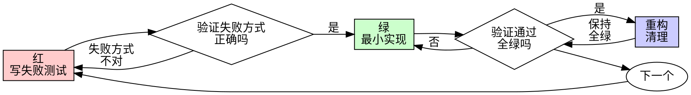

# 测试驱动开发（TDD）

## 概述

先写测试。看着它失败。再写刚好能通过的最小实现。

**核心原则：** 如果你没有亲眼看着测试失败，你就不知道它测的是不是对的东西。

**违反规则的字面，就是违反规则的精神。**

## 何时使用

**一律使用：**
- 新功能
- 缺陷修复
- 重构
- 行为变更

**例外（须征得用户同意）：**
- 用完即弃的原型
- 生成的代码
- 配置文件

想着"就这一次跳过 TDD"？停下。那是自我合理化。

## 铁律

```
没有先失败的测试，就没有生产代码
```

先写了代码再补测试？删掉代码。从头再来。

**没有例外：**
- 不许留作"参考"
- 不许写测试时"改编"它
- 不许看它
- 删除就是删除

从测试出发重新实现。句号。

## 红-绿-重构



### 红——写失败的测试

写一个最小的测试，展示应当发生什么。一轮循环只处理一个行为、一个失败。

**正例**
```typescript
test('retries failed operations 3 times', async () => {
  let attempts = 0;
  const operation = () => {
    attempts++;
    if (attempts < 3) throw new Error('fail');
    return 'success';
  };

  const result = await retryOperation(operation);

  expect(result).toBe('success');
  expect(attempts).toBe(3);
});
```
名字清晰，测试真实行为，只测一件事

**反例**
```typescript
test('retry works', async () => {
  const mock = jest.fn()
    .mockRejectedValueOnce(new Error())
    .mockRejectedValueOnce(new Error())
    .mockResolvedValueOnce('success');
  await retryOperation(mock);
  expect(mock).toHaveBeenCalledTimes(3);
});
```
名字含糊，测的是 mock 不是代码

**要求：**
- 一个行为（测试名里出现"并且"就拆开）
- 名字清晰
- 真实代码（除非迫不得已才用 mock）

### 验证红——亲眼看它失败

**强制。绝不跳过。**

```bash
npm test path/to/test.test.ts
```

确认：
- 测试失败（是失败，不是报错）
- 失败信息符合预期
- 因功能缺失而失败（不是笔误）

**测试通过了？** 说明你在测已有行为。修测试。

**测试报错了？** 修掉错误，重跑，直到它以正确的方式失败。

### 绿——最小实现

写最简单的能通过测试的代码。

**正例**
```typescript
async function retryOperation<T>(fn: () => Promise<T>): Promise<T> {
  for (let i = 0; i < 3; i++) {
    try {
      return await fn();
    } catch (e) {
      if (i === 2) throw e;
    }
  }
  throw new Error('unreachable');
}
```
刚好够通过

**反例**
```typescript
async function retryOperation<T>(
  fn: () => Promise<T>,
  options?: {
    maxRetries?: number;
    backoff?: 'linear' | 'exponential';
    onRetry?: (attempt: number) => void;
  }
): Promise<T> {
  // YAGNI
}
```
过度设计

不要加功能、不要重构别的代码、不要做测试之外的任何"改进"。

### 验证绿——亲眼看它通过

**强制。**

```bash
npm test path/to/test.test.ts
```

确认：
- 测试通过
- 其他测试仍然通过
- 输出干净（无错误、无警告）

**测试失败？** 修代码，不是修测试。

**其他测试失败？** 立即修。

### 重构——清理

只在绿之后做：
- 消除重复
- 改进命名
- 提取辅助函数

保持全绿。不加行为。

### 循环

为下一个功能写下一个失败测试。

## 好测试

| 品质 | 好 | 坏 |
|---------|------|-----|
| **最小** | 只测一件事。名字里有"并且"？拆开。 | `test('validates email and domain and whitespace')` |
| **清晰** | 名字描述行为 | `test('test1')` |
| **显意图** | 展示期望的 API 长什么样 | 看不出代码该做什么 |

写或改任何测试时，遵循以下让测试保持诚实的规则（源技能此处链接同目录 writing-good-tests.md，该文档未随本仓库迁移，核心规则已内联于此）：
- 动手写之前，先说出"改哪处生产代码会让这个测试失败"
- 断言真实行为，绝不断言 mock 行为
- 测试专用代码放在测试工具里，不进生产类
- mock 一个依赖之前，先弄清它的副作用

## 常见自我合理化

| 借口 | 现实 |
|--------|---------|
| "太简单不用测" | 简单代码也会坏。写测试只要 30 秒。 |
| "我事后补测试" | 事后写的测试一跑就过——这证明不了任何东西。它可能测错对象、测实现而非行为、漏掉你忘记的边界。你从没看过它失败，就从未证明它抓得住缺陷。测试先行强制制造那次失败。 |
| "事后测试达到同样目的（精神不是仪式）" | 事后测试回答"它现在做了什么"；先行测试回答"它应当做什么"。事后写的测试被你已写的代码带偏——你验证的是你记得的情形，不是你本会发现的情形。有覆盖率，没有"测试有效"的证明。 |
| "已经手工测过了" | 手工测试是即兴的：没记录覆盖了什么，代码一变没法重跑，压力下容易漏情形。"我试的时候是好的" ≠ 全面。自动化测试每次跑得一模一样。 |
| "删掉 X 小时的工作太浪费" | 沉没成本谬误——那时间反正已经花了。真正的选择是：用 TDD 重写（高置信）vs 留着它事后贴测试（低置信、大概率带缺陷）。留着你信不过的代码才是浪费。 |
| "留作参考，测试先行写" | 你会忍不住改编它。那就是事后测试。删除就是删除。 |
| "需要先探索" | 可以。探索完扔掉，从 TDD 开始。 |
| "测试难写 = 设计不清" | 听测试的。难测就是难用。 |
| "TDD 会拖慢我" | TDD 就是实用路径：提交前抓缺陷、防回归、让你敢重构。"实用"的捷径意味着在生产环境里调试——更慢，不是更快。 |
| "手工测更快" | 手工证明不了边界情形。每次改动你都得重测一遍。 |
| "存量代码没有测试" | 你正是在改进它。为存量代码补测试。 |

## 红旗——停下，从头再来

- 代码先于测试
- 实现之后补测试
- 测试立刻就通过
- 说不出测试为什么失败
- 测试"以后再加"
- 合理化"就这一次"
- "我已经手工测过了"
- "事后测试达到同样目的"
- "重要的是精神不是仪式"
- "留作参考"或"改编现有代码"
- "已经花了 X 小时，删掉太浪费"
- "TDD 太教条，我讲实用"
- "这次不一样，因为……"

**以上任何一条出现：删代码，用 TDD 重来。**

## 示例：缺陷修复

**缺陷：** 空邮箱被接受

**红**
```typescript
test('rejects empty email', async () => {
  const result = await submitForm({ email: '' });
  expect(result.error).toBe('Email required');
});
```

**验证红**
```bash
$ npm test
FAIL: expected 'Email required', got undefined
```

**绿**
```typescript
function submitForm(data: FormData) {
  if (!data.email?.trim()) {
    return { error: 'Email required' };
  }
  // ...
}
```

**验证绿**
```bash
$ npm test
PASS
```

**重构**
若多字段需要，提取校验逻辑。

## 验证清单

标记工作完成之前：

- [ ] 每个新函数/方法都有测试
- [ ] 实现前亲眼看过每个测试失败
- [ ] 每个测试因预期原因失败（功能缺失，不是笔误）
- [ ] 为每个测试写了最小实现
- [ ] 所有测试通过
- [ ] 输出干净（无错误、无警告）
- [ ] 测试用真实代码（仅迫不得已才用 mock）
- [ ] 边界情况与错误路径已覆盖

勾不满全部？你跳过了 TDD。重来。

## 卡住时

| 问题 | 解法 |
|---------|----------|
| 不知道怎么测 | 写下你期望中的 API。先写断言。问用户。 |
| 测试太复杂 | 设计太复杂。简化接口。 |
| 必须 mock 一切 | 代码耦合太重。用依赖注入。 |
| 测试准备代码巨大 | 提取辅助函数。还是复杂？简化设计。 |

## 与调试的衔接

发现缺陷？写一个重现它的失败测试，走 TDD 循环。测试证明修复有效并防止回归。

绝不修复没有测试的缺陷。

## 最终规则

```
生产代码 → 测试已存在且先失败过
否则     → 不是 TDD
```

未经用户许可，无例外。
