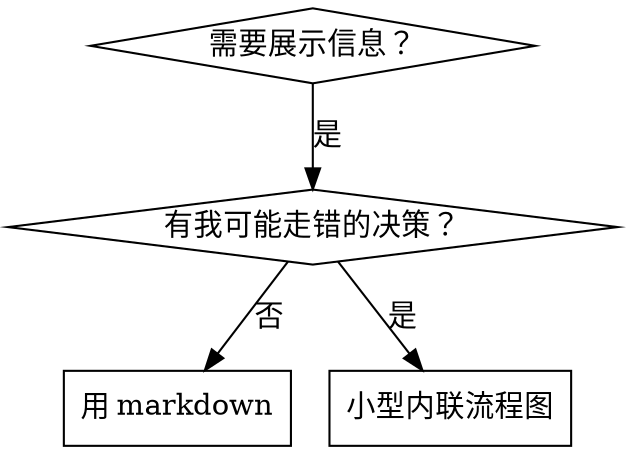

# 编写技能

## 概述

**编写技能就是把测试驱动开发应用于流程文档。**

本仓库的技能存放在 `.claude/skills/<技能名>/SKILL.md`（仓库级技能是本仓库的唯一形态；源技能关于其他运行时技能目录的指引未随本仓库迁移）。

你写测试用例（带子代理的施压场景），亲眼看它失败（基线行为），写技能（文档），亲眼看测试通过（代理遵从），重构（封堵漏洞）。

**核心原则：** 如果你没亲眼看过代理在没有技能时失败，你就不知道这个技能教的东西对不对。

**必备前置：** 使用本技能前必须理解本仓库的 tdd 技能。那个技能定义了根本的红-绿-重构循环。本技能把 TDD 适配到文档。

（源技能此处引用 anthropic-best-practices.md 官方指引，未随本仓库迁移；本文的方法与模式自成一体，可独立使用。）

## 什么是技能

**技能**是经过验证的技术、模式或工具的参考指南。技能帮助未来的代理找到并应用有效的方法。

**技能是：** 可复用的技术、模式、工具、参考指南

**技能不是：** 讲你某次如何解决一个问题的叙事

## 技能的 TDD 映射

| TDD 概念 | 技能创建 |
|-------------|----------------|
| **测试用例** | 带子代理的施压场景 |
| **生产代码** | 技能文档（SKILL.md） |
| **测试失败（红）** | 无技能时代理违反规则（基线） |
| **测试通过（绿）** | 技能在场时代理遵从 |
| **重构** | 保持遵从的同时封堵漏洞 |
| **先写测试** | 写技能前先跑基线场景 |
| **亲眼看它失败** | 逐字记录代理使用的合理化借口 |
| **最小代码** | 写针对那些具体违规的技能 |
| **亲眼看它通过** | 验证代理现在遵从 |
| **重构循环** | 发现新的合理化 → 封堵 → 复验 |

技能创建的整个过程遵循红-绿-重构。

## 何时创建技能

**创建，当：**
- 这项技术对你并非直觉显然
- 你会在多个项目中再次引用它
- 模式适用面广（不限单个项目）
- 其他人会受益

**不为以下创建：**
- 一次性解决方案
- 他处已有完善文档的标准实践
- 项目专属约定（放进你的指令文件，如 CLAUDE.md）
- 机械性约束（若可用正则/校验强制，就自动化它——文档留给需要判断力的场合）

## 技能类型

### 技术型
有步骤可循的具体方法（基于条件的等待、根因追踪）

### 模式型
思考问题的方式（带标志展平、测试不变量）

### 参考型
API 文档、语法指南、工具文档（office 文档）

## 目录结构

```
.claude/skills/
  <技能名>/
    SKILL.md              # 主参考（必需）
    辅助文件.*            # 仅在需要时
```

**扁平命名空间**——全部技能处于同一个可搜索的命名空间

**拆分独立文件，当：**
1. **重型参考**（100+ 行）——API 文档、完整语法
2. **可复用工具**——脚本、实用程序、模板

**保持内联：**
- 原则与概念
- 代码模式（<50 行）
- 其余一切

## SKILL.md 结构

**frontmatter（YAML）：**
- 两个必需字段：`name` 与 `description`（全部支持字段见 agentskills.io 的技能规范）
- 总计最多 1024 字符
- `name`：只用字母、数字与连字符（不用括号、特殊字符）
- `description`：第三人称，只描述何时使用（不描述它做什么）
  - 以"用于……时"开头，聚焦触发条件
  - 包含具体的症状、情境与上下文
  - **绝不概括技能的流程或工作流**（原因见 SDO 一节）
  - 尽量控制在 500 字符以内

```markdown
---
name: skill-name-with-hyphens
description: 用于[具体触发条件与症状]时
---

# 技能名

## 概述
这是什么？一两句话的核心原则。

## 何时使用
[决策不显时的小型内联流程图]

带症状与用例的条目列表
何时不用

## 核心模式（技术/模式型）
前后代码对比

## 速查
表格或条目，扫一眼就能查常见操作

## 实现
简单模式用内联代码
重型参考或可复用工具链接到独立文件

## 常见错误
什么会出错 ＋ 修正

## 真实影响（可选）
具体结果
```

## 技能发现优化（SDO）

**对发现至关重要：** 未来的代理需要能*找到*你的技能

### 1. 丰富的 description 字段

**目的：** 你的代理靠读 description 决定某任务该加载哪些技能。让它能回答："我现在该读这个技能吗？"

**格式：** 以"用于……时"开头，聚焦触发条件

**关键：description＝何时使用，不是技能做什么**

description 只该描述触发条件。不要在 description 里概括技能的流程或工作流。

**为何要紧：** 测试发现，当 description 概括了技能的工作流，代理可能照着 description 行事而不读技能全文。一条写着"任务之间做代码审查"的 description 曾让代理只做了一次审查——尽管技能的流程图清楚画着两次审查（先规格符合性、后代码质量）。

把 description 改成只有"用于在当前会话内执行含独立任务的实现计划时"（无工作流概括）之后，代理正确读了流程图，走上两阶段审查流程。

**陷阱：** 概括工作流的 description 会制造一条代理会走的捷径。技能正文沦为代理跳过的文档。

```yaml
# ❌ 坏：概括了工作流——代理可能照此行事而不读技能
description: 用于执行计划时——每任务派发子代理并在任务间做代码审查

# ❌ 坏：过程细节过多
description: 用于 TDD——先写测试、看它失败、写最小实现、重构

# ✅ 好：只有触发条件，无工作流概括
description: 用于在当前会话内执行含独立任务的实现计划时

# ✅ 好：只有触发条件
description: 用于实现任何功能或缺陷修复时、在写实现代码之前
```

**内容：**
- 用标志本技能适用的具体触发器、症状与情境
- 描述*问题*（竞态条件、行为不一致），而非*语言特定的症状*（setTimeout、sleep）
- 触发器保持技术无关，除非技能本身技术特定
- 技能技术特定时，在触发器里写明
- 用第三人称（会被注入系统提示）
- **绝不概括技能的流程或工作流**

```yaml
# ❌ 坏：太抽象、含糊，不含何时使用
description: 用于异步测试

# ❌ 坏：第一人称
description: 测试不稳定时我可以帮你做异步测试

# ❌ 坏：提到技术，但技能并不限于该技术
description: 用于测试使用 setTimeout/sleep 且时好时坏时

# ✅ 好："用于……时"开头，描述问题，无工作流
description: 用于测试存在竞态条件、时序依赖或时好时坏时

# ✅ 好：技术特定的技能带显式触发器
description: 用于使用 React Router 并处理认证重定向时
```

### 2. 关键词覆盖

用代理会拿来搜的词：
- 错误信息："Hook timed out"、"ENOTEMPTY"、"race condition"
- 症状："flaky"、"hanging"、"zombie"、"pollution"
- 同义词："timeout/hang/freeze"、"cleanup/teardown/afterEach"
- 工具：真实的命令、库名、文件类型

### 3. 描述性命名

**用主动语态，动词开头：**
- ✅ `creating-skills` 而非 `skill-creation`
- ✅ `condition-based-waiting` 而非 `async-test-helpers`

**按你做什么或核心洞见命名：**
- ✅ `condition-based-waiting` > `async-test-helpers`
- ✅ `using-skills` 而非 `skill-usage`
- ✅ `flatten-with-flags` > `data-structure-refactoring`
- ✅ `root-cause-tracing` > `debugging-techniques`

**动名词（-ing）适合流程：**
- `creating-skills`、`testing-skills`、`debugging-with-logs`
- 主动，描述你正在做的动作

### 4. token 效率（关键）

**问题：** getting-started 与高频引用的技能会载入每一次对话。每个 token 都算数。

**目标字数：**
- getting-started 工作流：各 <150 词
- 高频载入的技能：总共 <200 词
- 其他技能：<500 词（仍须精炼）

**手法：**

**把细节移到工具帮助里：**
```bash
# ❌ 坏：在 SKILL.md 里罗列全部旗标
search-conversations 支持 --text、--both、--after DATE、--before DATE、--limit N

# ✅ 好：引用 --help
search-conversations 支持多种模式与过滤器。运行 --help 看详情。
```

**用交叉引用：**
```markdown
# ❌ 坏：重复工作流细节
搜索时，用模板派发子代理……
[20 行重复的指令]

# ✅ 好：引用其他技能
始终用子代理（省 50-100 倍上下文）。必需：用 [其他技能名] 的工作流。
```

**压缩示例：**
```markdown
# ❌ 坏：冗长示例（42 词）
用户："以前在 React Router 里我们怎么处理认证错误？"
你：我来搜索过往会话中 React Router 认证的模式。
[派发子代理，查询："React Router authentication error handling 401"]

# ✅ 好：最小示例（20 词）
用户："React Router 认证错误以前怎么处理？"
你：搜索中……
[派发子代理 → 归并]
```

**消灭冗余：**
- 不重复交叉引用的技能里已有的内容
- 不解释从命令本身就能看出的东西
- 同一模式不放多个示例

**验证：**
```bash
wc -w .claude/skills/<技能名>/SKILL.md
# getting-started 工作流：各 <150 词
# 其他高频载入：总共 <200 词
```

### 5. 交叉引用其他技能

**写引用其他技能的文档时：**

只用技能名，配显式的必需标记：
- ✅ 好：`**必需子技能：** 用 tdd`
- ✅ 好：`**必备前置：** 你必须理解 systematic-debugging`
- ❌ 坏：`见 .claude/skills/tdd/SKILL.md`（看不出是否必需）
- ❌ 坏：`@.claude/skills/tdd/SKILL.md`（强制加载，烧上下文）

**为什么不用 @ 链接：** `@` 语法会立即强制加载文件，在你还需要它们之前就烧掉 20 万+ 上下文。

## 流程图使用



**流程图只用于：**
- 不显眼的决策点
- 你可能停得太早的流程循环
- "用 A 还是 B"的决策

**绝不用流程图于：**
- 参考材料 → 表格、列表
- 代码示例 → markdown 代码块
- 线性指令 → 有序列表
- 无语义的标签（step1、helper2）

（源技能本节引用同目录的 graphviz-conventions.dot 与 render-graphs.js，未随本仓库迁移；上述"只用/绝不用"清单即其核心规则。）

## 代码示例

**一个出色的示例胜过多个平庸的**

选最相关的语言：
- 测试技术 → TypeScript/JavaScript
- 系统调试 → Shell/Python
- 数据处理 → Python

**好示例：**
- 完整且可运行
- 注释解释"为什么"
- 来自真实场景
- 清楚展示模式
- 拿来即可改编（不是泛型模板）

**不要：**
- 用 5+ 种语言实现
- 造填空式模板
- 编造假想示例

你擅长移植——一个好示例就够了。

## 文件组织

### 自包含技能
```
.claude/skills/defense-in-depth/
  SKILL.md    # 一切内联
```
当：全部内容装得下，无重型参考需求

### 带可复用工具的技能
```
.claude/skills/condition-based-waiting/
  SKILL.md    # 概述 + 模式
  example.ts  # 可改编的可用辅助函数
```
当：工具是可复用代码，不只是叙事

### 带重型参考的技能
```
.claude/skills/pptx/
  SKILL.md       # 概述 + 工作流
  pptxgenjs.md   # 600 行 API 参考
  ooxml.md       # 500 行 XML 结构
  scripts/       # 可执行工具
```
当：参考材料大到无法内联

## 铁律（同 TDD）

```
没有先失败的测试，就没有技能
```

适用于新技能，也适用于对既有技能的**编辑**。

先写技能再测试？删掉。从头再来。
不测试就改技能？同样的违规。

**没有例外：**
- "简单的新增"不行
- "只加一节"不行
- "文档更新"不行
- 不许把未测试的改动留作"参考"
- 不许跑测试时"顺手改编"
- 删除就是删除

**必备前置：** 本仓库的 tdd 技能解释了这为何要紧。同样的原则适用于文档。

## 测试所有技能类型

不同技能类型需要不同的测试方法：

### 纪律强制型技能（规则/要求）

**例：** tdd、verification、设计先行

**测什么：**
- 理论题：它们理解规则吗？
- 施压场景：压力之下它们遵从吗？
- 多重压力叠加：时间 + 沉没成本 + 疲劳
- 识别合理化借口并加显式反制

**成功标准：** 最大压力下代理仍守规则

### 技术型技能（操作指南）

**例：** 基于条件的等待、根因追踪、防御式编程

**测什么：**
- 应用场景：能正确应用该技术吗？
- 变体场景：能处理边界情形吗？
- 缺信息测试：指令有缺口吗？

**成功标准：** 代理成功把技术应用于新场景

### 模式型技能（心智模型）

**例：** 降低复杂度、信息隐藏概念

**测什么：**
- 识别场景：能认出模式何时适用吗？
- 应用场景：能用这个心智模型吗？
- 反例：知道何时不该用吗？

**成功标准：** 代理正确识别何时/如何应用模式

### 参考型技能（文档/API）

**例：** API 文档、命令参考、库指南

**测什么：**
- 检索场景：能找到正确的信息吗？
- 应用场景：能正确使用找到的信息吗？
- 缺口测试：常见用例覆盖了吗？

**成功标准：** 代理找到并正确应用参考信息

## 跳过测试的常见自我合理化

| 借口 | 现实 |
|--------|---------|
| "技能显然够清楚" | 对你清楚 ≠ 对其他代理清楚。测它。 |
| "它只是参考" | 参考也会有缺口、有含糊小节。测检索。 |
| "测试太杀鸡用牛刀" | 未测试的技能必有问题，总是如此。15 分钟测试省数小时。 |
| "出问题再测" | 问题＝代理用不了技能。部署前测。 |
| "测试太繁琐" | 比在生产里调试坏技能更不繁琐。 |
| "我有信心它是好的" | 过度自信保证出问题。照样测。 |
| "学术审查就够了" | 读过 ≠ 用过。测应用场景。 |
| "没时间测" | 部署未测试的技能，日后修它更费时。 |

**以上每一条的意思都是：部署前测试。没有例外。**

## 形式匹配失败类型

写指引之前，先给基线失败分类。能让一种失败类型变得无懈可击的形式，放到另一种上会明显适得其反。

| 基线失败 | 正确形式 | 错误形式 |
|---|---|---|
| 压力下跳过/违反规则（知道该怎么做，还是做了） | 禁令 ＋ 合理化表 ＋ 红旗（见下文"让技能对合理化免疫"） | 软指引（"prefer…"、"consider…"） |
| 遵从了，但产出形状不对（提示臃肿、裁决被埋、复述规格） | 正向配方或契约：陈述产出*是*什么——它的组成部分、按什么顺序 | 禁令清单（"don't restate"、"never narrate"） |
| 在本来就会产出的东西里漏掉必需元素 | 结构化：模板里一个 REQUIRED 字段或槽位让它填 | 模板旁的散文提醒 |
| 行为应随条件而变 | 键在可观察谓词上的条件句（"若简报存在，引用它"） | 无条件规则 ＋ 豁免条款 |

**为什么禁令在塑形问题上适得其反：** 在竞争性激励（"让提示自包含"）之下，代理会跟"不许 X"讨价还价。在派发提示指引的措辞对比测试中，禁令组产出的有害内容明显多于配方组（分布完全分离），甚至比无指引对照组还要差——自己的案例要微测，别想当然，但绝不默认伸手拿禁令。配方没有讨价还价的空间：产出要么符合陈述的形状，要么不符合。

**无论选哪种形式，都要守的规则：**
- **不许有细微例外子句。**"除非要紧，否则不许 X"重新打开谈判——在同样的措辞测试里，给一个获胜配方附加一条细微例外子句，把它从稳定降级为噪声。真实的例外写成键在可观察谓词上的独立条件句。
- **豁免条款圈不住范围。**"此上限不适用于代码块"仍会压制代码块。若产出的一部分必须豁免，就重构结构，让规则够不着它。

## 让技能对合理化免疫

强制纪律的技能（如 tdd）需要抵御合理化。代理很聪明，压力之下会找漏洞。

**适用范围：** 这套工具用于纪律型失败——知道规则却在压力下跳过的代理。对形状错误或漏元素的产出，基于禁令的免疫会适得其反；改用"形式匹配失败类型"里的形式。

（源技能此处引用 persuasion-principles.md 研究基础，未随本仓库迁移；其要点为权威、承诺、稀缺、社会认同、联盟五原则——理解说服技巧为何生效，有助于你系统性地运用它们。）

### 显式封堵每一个漏洞

不要只陈述规则——把具体的变通手法也禁掉：

<坏>
```markdown
先写代码后写测试？删掉。
```
</坏>

<好>
```markdown
先写代码后写测试？删掉。从头再来。

**没有例外：**
- 不许留作"参考"
- 不许写测试时"改编"它
- 不许看它
- 删除就是删除
```
</好>

### 处理"精神 vs 字面"之争

尽早加上根本原则：

```markdown
**违反规则的字面，就是违反规则的精神。**
```

这掐掉整类"我遵循的是精神"的合理化。

### 建合理化表

从基线测试（见下文测试各节）捕获合理化。代理说的每个借口都进表：

```markdown
| 借口 | 现实 |
|--------|---------|
| "太简单不用测" | 简单代码也会坏。写测试只要 30 秒。 |
| "我事后补测试" | 事后测试一跑就过，证明不了任何东西。 |
| "事后测试达到同样目的" | 事后测试答"它现在做什么"；先行测试答"它应当做什么"。 |
```

### 建红旗清单

让代理合理化时容易自检：

```markdown
## 红旗——停下，从头再来

- 代码先于测试
- "我已经手工测过了"
- "事后测试达到同样目的"
- "重要的是精神不是仪式"
- "这次不一样，因为……"

**以上任何一条出现：删代码，用 TDD 重来。**
```

### 为违规症状更新 SDO

向 description 加上"你即将违反规则"的症状：

```yaml
description: 用于实现任何功能或缺陷修复时、在写实现代码之前
```

## 技能的红-绿-重构

跟随 TDD 循环：

### 红——写失败的测试（基线）

不带技能对子代理跑施压场景。逐字记录行为：
- 他们做了什么选择？
- 用了什么合理化借口（逐字）？
- 哪些压力触发了违规？

这就是"亲眼看测试失败"——写技能之前，你必须看到代理自然而然会做什么。

### 绿——写最小技能

写针对那些具体合理化的技能。不为假想情形添加多余内容。

带技能重跑同一场景。代理现在应当遵从。

### 重构——封堵漏洞

代理找到了新的合理化？加显式反制。重测直到无懈可击。

### 全场景之前先微测措辞

完整的施压场景是最终关卡，但每次迭代又慢又贵。先用微测验证措辞本身：

1. **每次调用一个全新上下文样本**——裸 API 调用，或没有 API 权限时的单发子代理。系统提示＝该指引将来生活的真实上下文（完整技能或提示模板，不是孤立的指引）；用户消息＝诱使失败的任务。
2. **永远带一个无指引对照组。** 对照组不表现出该失败，就没有要修的东西——停，别去写指引。
3. **每个变体 5+ 次重复。** 单样本会说谎。
4. **逐条人工读每个命中。** 想程序化打分可以，但模板回声与被引用的反例会冒充命中；自动计数会同时高估失败与成功。
5. **方差本身就是指标。** 指引生效时，重复会收敛到同一形状。五次重复五种解读，说明措辞没有约束力——先收紧形式，再加字数。

微测验证措辞；对纪律型技能，它不替代施压场景。

（源技能此处引用 testing-skills-with-subagents.md 完整测试方法论——如何写施压场景、压力类型（时间、沉没成本、权威、疲劳）、系统性封堵漏洞、元测试技巧——该文档未随本仓库迁移，核心方法已内联于本节与"测试所有技能类型"。）

## 反模式

### ❌ 叙事式示例
"2025-10-03 那次会话里，我们发现空的 projectDir 导致……"
**为何坏：** 太特定，不可复用

### ❌ 多语言稀释
example-js.js、example-py.py、example-go.go
**为何坏：** 质量平庸，维护负担

### ❌ 流程图里放代码
```dot
step1 [label="import fs"];
step2 [label="read file"];
```
**为何坏：** 没法复制粘贴，难读

### ❌ 泛型标签
helper1、helper2、step3、pattern4
**为何坏：** 标签应当有语义

## 停下：进入下一个技能之前

**写完任何一个技能之后，必须停下，完成部署流程。**

**不许：**
- 不逐个测试就批量创建多个技能
- 当前技能未验证就进入下一个
- 因为"批量更高效"而跳过测试

**下方的部署清单对每个技能都是强制的。**

部署未测试的技能＝部署未测试的代码。这是对质量标准的违规。

## 技能创建清单（TDD 版）

**重要：为下面每一条清单项建一条待办。**

**红阶段——写失败的测试：**
- [ ] 创建施压场景（纪律型技能须 3+ 种叠加压力）
- [ ] 不带技能跑场景——逐字记录基线行为
- [ ] 识别合理化/失败中的模式

**绿阶段——写最小技能：**
- [ ] 名字只用字母、数字、连字符（无括号/特殊字符）
- [ ] YAML frontmatter 含必需的 `name` 与 `description` 字段（最多 1024 字符）
- [ ] description 以"用于……时"开头，含具体触发器/症状
- [ ] description 用第三人称
- [ ] 全文布关键词便于搜索（错误、症状、工具）
- [ ] 清晰的概述加核心原则
- [ ] 针对红阶段识别的具体基线失败
- [ ] 指引形式匹配失败类型（见"形式匹配失败类型"）
- [ ] 行为塑形类指引：措辞经无指引对照组微测（5+ 重复，逐条人工读命中）——纯参考型技能记 N/A
- [ ] 代码内联，或链接到独立文件
- [ ] 一个出色的示例（不求多语言）
- [ ] 带技能跑场景——验证代理现在遵从

**重构阶段——封堵漏洞：**
- [ ] 识别测试中出现的新合理化
- [ ] 加显式反制（纪律型技能）
- [ ] 用全部测试迭代建合理化表
- [ ] 建红旗清单
- [ ] 重测直到无懈可击

**质量检查：**
- [ ] 仅决策不显时用小型流程图
- [ ] 速查表
- [ ] 常见错误一节
- [ ] 无叙事式讲故事
- [ ] 辅助文件仅用于工具或重型参考

**部署：**
- [ ] 把技能提交进 git
- [ ] （若广泛有用）考虑通过 PR 回馈

## 发现工作流

未来的代理如何找到你的技能：

1. **遇到问题**（"测试时好时坏"）
2. **搜索技能**（grep description，浏览分类）
3. **找到技能**（description 匹配）
4. **扫概述**（这个相关吗？）
5. **读模式**（速查表）
6. **载入示例**（只在实施时）

**为此流程优化**——可搜索的词放早、放多。
