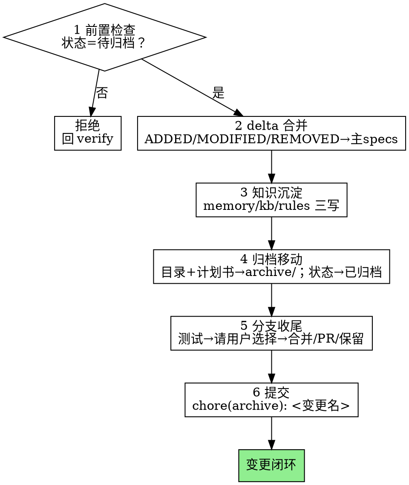

# Archive——归档阶段

把已验证的变更变成仓库的长期事实：delta 并进主 specs，知识沉进 ai-kb，目录移入 archive，分支合回 main——六步走完，变更闭环。

**硬门禁（G4）：** 两阶段审查未通过（`状态:` 不是`待归档`），不得归档。

**开场声明：**"我正在使用 archive 技能归档本变更。"

## 流程总览



## 六步流程（第 6 步提交时点随第 5 步选择调整，见执行顺序说明）

### 第 1 步：前置检查

读 `openspec/changes/<变更名>/proposal.md` 的 `状态:`：

- `待归档` → 通过
- `待验证` → 审查未过，回 verify 技能；`构建中` → 回 build 技能；`已归档` → 本变更已收尾，无事可做

### 第 2 步：delta 合并

逐条把 `openspec/changes/<变更名>/specs/<能力>/spec.md` 的 delta 应用到主规格 `openspec/specs/<能力>/spec.md`：

| delta 标注 | 应用方式 |
|---|---|
| `ADDED` | 追加为主规格的新 Requirement（连同其全部 Scenario） |
| `MODIFIED` | 整条替换主规格中同名标题的 Requirement |
| `REMOVED` | 从主规格删除对应 Requirement |

- 主规格尚无该能力的 spec.md 时先创建，以 delta 内容为初始全集（去掉 `## ADDED Requirements` 包装层）
- 合并后重读一遍：无重复 Requirement 标题、无残留 ADDED/MODIFIED/REMOVED 标注——主规格读起来是一份完整规格，不是变更记录

### 第 3 步：知识沉淀（ai-kb 三写）

- **memory 归整**：本变更构建与审查期即时记下的坑，去重、按模块归位（`.codex/ai-kb/memory/<模块>.md`，条目格式见 `.codex/ai-kb/README.md`）
- **kb 同步**：本变更改变了模块功能或架构 → 更新 `.codex/ai-kb/kb/<模块>.md`；open 阶段提示过的过时内容在此一并修正
- **rules 更新**：新增模块、别称或关键词 → 更新 `.codex/ai-kb/rules/index.md` 路由表
- 验收标准：下次会话靠这三层能少踩坑。照抄变更描述不算沉淀

### 第 4 步：归档移动与终检

- 变更目录整体移入归档：`openspec/changes/<变更名>/` → `openspec/archive/<变更名>/`（用 `git mv`，历史可追溯）
- 计划书随之归位：`openspec/plan/<变更名>.md` **移入** `openspec/archive/<变更名>/plan.md`——`openspec/plan/` 只留活跃变更的计划
- 移动后终检：
  - `openspec/changes/` 不再含本变更、`openspec/plan/` 不再含本计划
  - `openspec/archive/<变更名>/tasks.md` 全部勾选（最后一道全勾检查）
  - `openspec/archive/<变更名>/proposal.md` 的 `状态:` 改为 `已归档`

### 第 5 步：分支收尾（合并是用户的决定）

分支的整合归用户决定，不归你——先呈选项、等答复，绝不代用户合并。（收尾纪律源自源插件技能，该技能未随本仓库迁移，纪律内联如下。）

1. 在分支上跑完整测试套件——红着不许进入收尾
2. 向用户呈报并等待选择：
   > 归档就绪。`feature/<变更名>` 分支如何处理？
   > 1. 合回 main（--no-ff）并删除分支
   > 2. 推送并建 PR
   > 3. 保留分支暂不处理
3. **选合并**：先确认基分支（通常 main；拿不准就问——合错基分支代价高昂），执行顺序：
   1. 先做第 6 步的归档提交——未提交的本分支新增文件会被 `git checkout` 摧毁
   2. 在 worktree 内实现时，先回主仓库根目录再切换——`git checkout main` 被拒的原因是 main 已被主仓库工作区检出
   3. `git checkout main` → `git merge --no-ff feature/<变更名>`
   4. 在合并结果上**再跑一次测试**
4. 合并结果测试红：停下排查，分支与 worktree 原地保留——一切还在本地，可恢复
5. 全绿后清理：`git branch -d feature/<变更名>`；有 worktree 时按 git-worktrees 技能清理本工作流创建的那个，别的 worktree 不碰
6. **选 PR**：先做第 6 步提交，`git push -u origin feature/<变更名>` 后按平台工具建 PR，并把 PR 地址报给用户；worktree 保留。推送被拒：查清原因再动——远端有新提交就先对齐，仅凭用户明确要求才 force-push
7. **选保留**：做第 6 步提交，报告分支与 worktree 位置，收尾
8. **用户明确要求丢弃本变更时**：此路径只作为对明确请求的响应，绝不主动提议。先列出将被永久删除的内容——分支名、其上的全部提交、worktree 路径——并要求用户逐字回复"丢弃"确认；确认后按第 5 条规则清理 worktree，再 `git branch -D feature/<变更名>` 强删分支

### 第 6 步：提交

归档的全部文件变更（specs 合并、ai-kb 三写、目录与计划书移动）收口为**恰好一次**提交：

```bash
git add openspec/ .codex/ai-kb/ && git commit -m "chore(archive): <变更名>"
```

- 落点随第 5 步的选择：选合并时在切换分支前完成（见第 5 步执行顺序）；选 PR 或保留时在 feature 分支上完成
- 提交后核对：工作树干净；`git log` 可见归档提交与（若合并）合并提交

## 常见自我合理化

| 借口 | 现实 |
|---|---|
| "delta 合并就是复制粘贴" | ADDED 追加、MODIFIED 整条替换、REMOVED 删除——三条语义各不相同，错一条主规格就失真。 |
| "知识沉淀改天再说" | 沉淀是归档六步之一，不是可选项。这次不写，下次会话从零踩坑。 |
| "用户肯定想合并，直接合了" | 整合是用户的决定。呈选项、等答复，选项单不许增删。 |
| "用户嫌麻烦，我提议干脆丢弃" | 丢弃不在选项单里。只有用户明确要求才走丢弃路径，且须逐字确认"丢弃"。 |
| "合并完顺手把别的 worktree 清了" | 只清理本工作流创建的 worktree。别的属于它的主人。 |
| "归档提交拆几个更清晰" | 归档收口为恰好一次 `chore(archive)` 提交——specs/kb/移动是一个动作的两面。 |
| "计划书留在 plan/ 里也无所谓" | plan/ 只留活跃变更。留着它，下个会话会把已归档变更当活跃的做。 |
