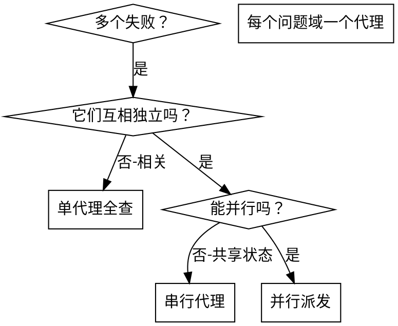

# 派发并行代理

> **Codex 执行环境：** 本文的「派发子代理」一律用 `spawn_agent`（`fork_turns: "none"`，全新上下文）执行；续发追问用 `followup_task`（仅传消息用 `send_message`），收结果用 `wait_agent`。工具映射见 `.codex/README.md`。

## 概述

你把任务委派给拥有隔离上下文的专门代理：精确构造它们的指令与上下文，使其保持专注；它们绝不继承你会话的上下文或历史——这也把你自己的上下文留给协调工作。

面对多个互不相关的失败（不同测试文件、子系统、缺陷）时，串行调查是浪费；每项调查独立，可并行进行。

**核心原则：** 每个独立问题域派一个代理，让它们并发工作。

## 何时使用



**使用条件：** 不少于 3 个测试文件失败且根因各不相同；多个子系统各自独立损坏；每个问题无需其他问题的上下文即可理解；无共享状态。

**不要使用：** 失败之间相关（修好一个可能连带修好其他）；需要理解系统全貌；代理之间会互相干扰。

## 模式

### 1. 识别独立问题域

按"什么坏了"分组。示例（安装器门禁跑完后的三类失败）：

- `scripts/tests/test_install_workflow.py` 装后自检用例红——安装器端到端域
- `scripts/lib/validate-workflow-core.sh` 归档索引检查红——结构校验域
- `scripts/tests/test_install_ai_workflow.py` manifest 枚举用例红——便携安装器契约域

每个域独立：修安装器复制不影响校验器检查或 manifest 契约。

### 2. 构造聚焦的代理任务

每个代理拿到：**明确范围**（一个测试文件或一个子系统）、**清晰目标**（让这些测试通过）、**约束**（不改其他代码）、**预期输出**（发现了什么、修了什么的总结）。

### 3. 并行派发

同一条回复里发出全部派发＝并行执行；每条回复一个＝串行。

### 4. 审查与汇合

逐份读总结、核对互不冲突，跑完整套件后集成（详见「验证」）。

## 代理提示结构

好的代理提示：**聚焦**（一个问题域）、**自包含**（错误输出、测试名、相关文件等全部上下文）、**输出明确**（应当返回什么）。示例：

```markdown
修复 validate-workflow.sh --fast 中 [FAIL] 归档索引与目录 1:1：
1. 读 scripts/lib/validate-workflow-core.sh 的 archive_index_ok，理解三种失败模式
2. 核对 openspec/archive/ 目录与 README.md 索引行
3. 只修索引或该检查暴露的真实数据缺口，不改其他检查
不许绕过检查或放宽断言——找到真实原因。
返回：根因与改动的总结。
```

## 常见错误

| 错误 | 正确处理 |
|---|---|
| 太宽泛："把测试全修了" | 具体："修 test_install_workflow.py 的 LegacyLayoutTests" |
| 没上下文："修那个红" | 粘贴 `[FAIL]` 行与触发命令 |
| 没约束：代理可能把一切重构了 | 给约束："不许改生产代码"或"只修测试" |
| 输出含糊："修好它" | 具体："返回根因与改动的总结" |

## 何时不该用

**失败相关**：修好一个可能连带修好其他——先一起调查（用 systematic-debugging）。**需要全量上下文**：理解问题需要看到整个系统。**探索式调试**：你还不知道什么坏了。**共享状态**：代理会互相干扰（改同一批文件、用同一批资源）。

## 验证

代理返回之后：逐份审查总结；查冲突（是否改了同一处代码）；跑完整套件验证修复协同有效；抽查——代理可能犯系统性错误。
