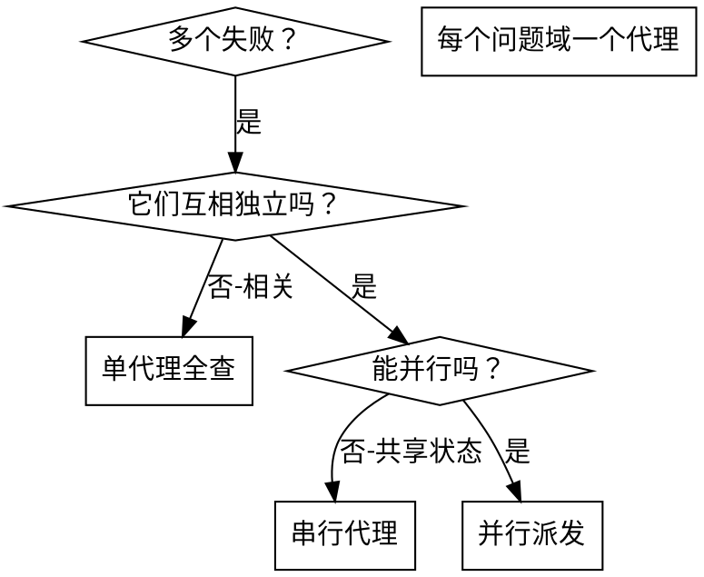

# 派发并行代理

> **Codex 执行环境：** 本文的「派发子代理」一律用 `multi_agent_v1__spawn_agent`（`fork_context: false`，全新上下文）执行；续发追问用 `send_input`，收结果用 `wait_agent`，用完 `close_agent`。工具映射见 `.codex/README.md`。

## 概述

你把任务委派给拥有隔离上下文的专门代理。通过精确构造它们的指令与上下文，你确保它们保持专注并完成各自任务。它们绝不继承你会话的上下文或历史——你精确构造它们所需的一切。这同时也把你自己的上下文留给协调工作。

当你面对多个互不相关的失败（不同测试文件、不同子系统、不同缺陷）时，串行调查是在浪费时间。每项调查都相互独立，可以并行进行。

**核心原则：** 每个独立问题域派一个代理。让它们并发工作。

## 何时使用



**使用条件：**
- 不少于 3 个测试文件失败且根因各不相同
- 多个子系统各自独立损坏
- 每个问题无需其他问题的上下文即可理解
- 各项调查之间无共享状态

**不要使用：**
- 失败之间相关（修好一个可能连带修好其他）
- 需要理解系统全貌
- 代理之间会互相干扰

## 模式

### 1. 识别独立问题域

按"什么坏了"分组：
- 文件 A 的测试：工具审批流
- 文件 B 的测试：批量完成行为
- 文件 C 的测试：中止功能

每个域都独立——修工具审批不影响中止测试。

### 2. 构造聚焦的代理任务

每个代理拿到：
- **明确范围：** 一个测试文件或一个子系统
- **清晰目标：** 让这些测试通过
- **约束：** 不改其他代码
- **预期输出：** 发现了什么、修了什么的总结

### 3. 并行派发

在同一条回复里发出全部三个子代理派发——它们并行运行：

```text
子代理（general-purpose）："修复 agent-tool-abort.test.ts 的失败"
子代理（general-purpose）："修复 batch-completion-behavior.test.ts 的失败"
子代理（general-purpose）："修复 tool-approval-race-conditions.test.ts 的失败"
# 三个并发运行。
```

一条回复里的多个派发调用 = 并行执行。每条回复一个 = 串行。

### 4. 审查与汇合

代理返回时：
- 逐份读总结
- 核对修复互不冲突
- 运行完整测试套件
- 集成全部变更

## 代理提示结构

好的代理提示：
1. **聚焦**——一个清晰的问题域
2. **自包含**——理解问题所需的全部上下文
3. **输出明确**——代理应当返回什么？

```markdown
修复 src/agents/agent-tool-abort.test.ts 中 3 个失败的测试：

1. "should abort tool with partial output capture" - 期望消息中有 'interrupted at'
2. "should handle mixed completed and aborted tools" - 快工具被中止而非完成
3. "should properly track pendingToolCount" - 期望 3 个结果但得到 0

这些是时序/竞态问题。你的任务：

1. 读测试文件，理解每个测试验证什么
2. 定位根因——是时序问题还是真实缺陷？
3. 修复方式：
   - 用基于事件的等待取代随意定的超时
   - 若发现中止实现的缺陷则修复它
   - 若测试的行为已变则调整测试预期

不许只加大超时——找到真正的问题。

返回：你发现了什么、修了什么的总结。
```

## 常见错误

**❌ 太宽泛：** "把测试全修了"——代理会迷失
**✅ 具体：** "修复 agent-tool-abort.test.ts"——范围聚焦

**❌ 没上下文：** "修那个竞态"——代理不知道在哪
**✅ 给上下文：** 粘贴错误信息与测试名

**❌ 没约束：** 代理可能把一切都重构了
**✅ 给约束：** "不许改生产代码"或"只修测试"

**❌ 输出含糊：** "修好它"——你不知道改了什么
**✅ 具体：** "返回根因与改动的总结"

## 何时不该用

**失败相关：** 修好一个可能连带修好其他——先一起调查
**需要全量上下文：** 理解问题需要看到整个系统
**探索式调试：** 你还不知道什么坏了
**共享状态：** 代理会互相干扰（改同一批文件、用同一批资源）

## 来自真实会话的示例

**场景：** 大重构后 3 个文件共 6 个测试失败

**失败分布：**
- agent-tool-abort.test.ts：3 个失败（时序问题）
- batch-completion-behavior.test.ts：2 个失败（工具不执行）
- tool-approval-race-conditions.test.ts：1 个失败（执行数 = 0）

**决策：** 独立问题域——中止逻辑、批量完成、竞态条件互不相干

**派发：**
```
代理 1 → 修复 agent-tool-abort.test.ts
代理 2 → 修复 batch-completion-behavior.test.ts
代理 3 → 修复 tool-approval-race-conditions.test.ts
```

**结果：**
- 代理 1：用基于事件的等待取代超时
- 代理 2：修复事件结构缺陷（threadId 放错了位置）
- 代理 3：补上对异步工具执行完成的等待

**汇合：** 所有修复相互独立、无冲突，完整套件全绿

## 验证

代理返回之后：
1. **逐份审查总结**——理解改了什么
2. **查冲突**——代理是否改了同一处代码？
3. **跑完整套件**——验证所有修复协同有效
4. **抽查**——代理可能犯系统性错误
