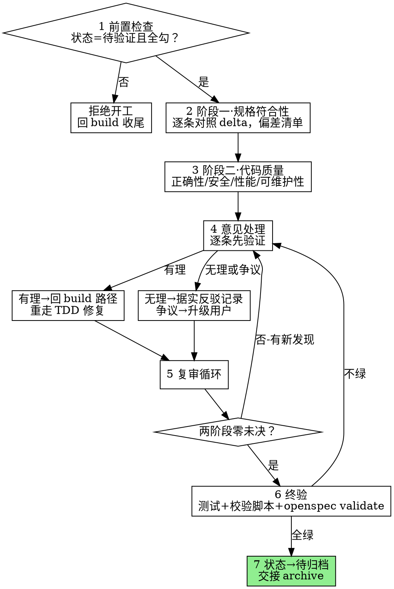

# Verify——验证阶段

> **Codex 执行环境：** 本文的「派发子代理」一律用 `multi_agent_v1__spawn_agent`（`fork_context: false`，全新上下文）执行；续发追问用 `send_input`，收结果用 `wait_agent`，用完 `close_agent`。工具映射见 `.codex/README.md`。

构建完成不等于做对了。两个独立子代理分别审**规格符合性**与**代码质量**，意见逐条先验证再处理，最后现跑全套验证命令留存证据——两阶段零未决且终验全绿，才放行归档。

**硬门禁（G4）：** 两阶段审查未通过，不得归档。前置是 G3 已过——`状态:` 不是`待验证`、或 tasks 未全勾，拒绝开工。

**开场声明：**"我正在使用 verify 技能做两阶段审查。"

## 流程总览

## 七步流程

### 第 1 步：前置检查

读 `openspec/changes/<变更名>/proposal.md` 的 `状态:` 与 `tasks.md` 勾选：

- `状态:` = `待验证` 且全勾 → 通过
- `构建中` 或有未勾 → G3 未过，回 build 技能收尾——状态字段说什么不重要，勾没勾完才重要
- `草稿`/`待确认规范` → 四件套未确认，回 open 技能；`设计中`/`待确认计划` → 计划未确认，回 design 技能
- `待归档`/`已归档` → 审查已过，去 archive 技能

### 第 2 步：阶段一·规格符合性审查

派发**独立子代理**（全新上下文——审查者拿到的是精确构造的评估材料，绝不是实现过程的历史）：

- **输入**：`openspec/changes/<变更名>/specs/<能力>/spec.md` 的 delta（逐条 Requirement 及其 Scenario）＋ 整分支 diff（BASE 取 `git merge-base main HEAD`）
- **任务**：逐条对照 delta Requirement，输出**"规格-代码偏差"清单**，每条定位到 file:line 并注明类别：
  - **缺失**——delta 要求了，代码没有（附对应 Requirement 原文）
  - **越界**——代码做了，delta 没要求
  - **偏差**——做了，但与要求不符
- **验收标准**："需求已满足"的证明是逐条清单核对，不是"测试通过了"（verification 技能）

### 第 3 步：阶段二·代码质量审查

另派一个独立子代理（与阶段一分开派发——两份注意力不互相污染）：

- **输入**：同一分支 diff
- **任务**：四个维度找缺陷——**正确性 / 安全 / 性能 / 可维护性**——输出分级清单：Critical（必须修：缺陷、安全、数据丢失、功能破坏）、Important（应修：架构问题、错误处理差、测试缺口）、Minor（记下待办：风格、润色）；每条含 file:line、什么错了、为何要紧、怎么修
- 审查者提示的核心要素与输出格式按 code-review 技能·请求侧执行；审查者只读，不改工作树

### 第 4 步：意见处理（先验证，后实施）

两阶段的意见逐条走 code-review 技能·接收侧纪律：

1. **读完整条意见 → 用自己的话复述 → 对照代码库现实核查**——绝不"您说得对！"式表演性顺从，绝不未经验证就实施
2. **有理** → 修复。修复是代码变更，回到 build 技能的实现路径重走 TDD（先写失败测试，再修——审查修复不豁免红-绿循环），修完带修复 diff 回第 5 步复审
3. **无理** → 据实反驳并记录：技术推理＋可运行的代码/测试为证；反驳与依据随审查结论留存
4. **争议**（与实现者各执一词、或意见与用户既有决定冲突）→ 升级用户仲裁——不停战、不硬裁
5. 实施顺序：阻断性（破坏/安全）→ 简单（笔误/导入）→ 复杂（重构/逻辑），每条修复单独测试

### 第 5 步：复审循环

- 有修复，就把修复 diff 交回对应阶段的审查子代理做**范围化复审**（只验修复，不重审全分支）
- 循环直至两阶段**零未决问题**：Critical/Important 全部修复，或经用户仲裁正式驳回并记录；Minor 记入待办清单，不阻塞
- "差不多干净了"不是零未决——G4 卡的就是这一步

### 第 6 步：终验

没有新近的验证证据，禁止声称验证通过——现跑、跑全、逐个核对退出码，输出全部留存：

1. 完整测试套件（输出 0 失败）
2. `./scripts/validate-workflow.sh`（exit 0）
3. 装有 openspec CLI 的机器：`openspec validate <变更名> --strict --no-interactive`；未装则跳过，格式以 `openspec/AGENTS.md` 为准

任何一项不绿：走第 4 步流程修复后，从头重跑终验——部分验证证明不了任何东西。

### 第 7 步：出口

- 两阶段零未决 ＋ 终验全绿 → `状态:` 置为 `待归档`，提交审查修复与状态变更
- 交接：向用户呈报两阶段审查结论与终验证据，归档由 archive 技能承接

## 常见自我合理化

| 借口 | 现实 |
|---|---|
| "实现者自审过了" | 自审替代不了独立审查。两个阶段、两个全新上下文，各自存在。 |
| "测试绿了，规格肯定满足" | 测试通过 ≠ 需求逐条核对。阶段一的存在理由就是这个差距。 |
| "审查者说得都对，照改" | 未验证就实施是表演性顺从。先核查，有理才改。 |
| "反驳审查者不礼貌" | 技术正确性高于社交舒适。无理的意见据实反驳并记录。 |
| "还有几个小问题，先归档" | G4：零未决才放行。Minor 记待办，Critical/Important 修完或经用户仲裁。 |
| "终验刚才跑过了" | 终验要现跑。证据先于断言，没有例外。 |
